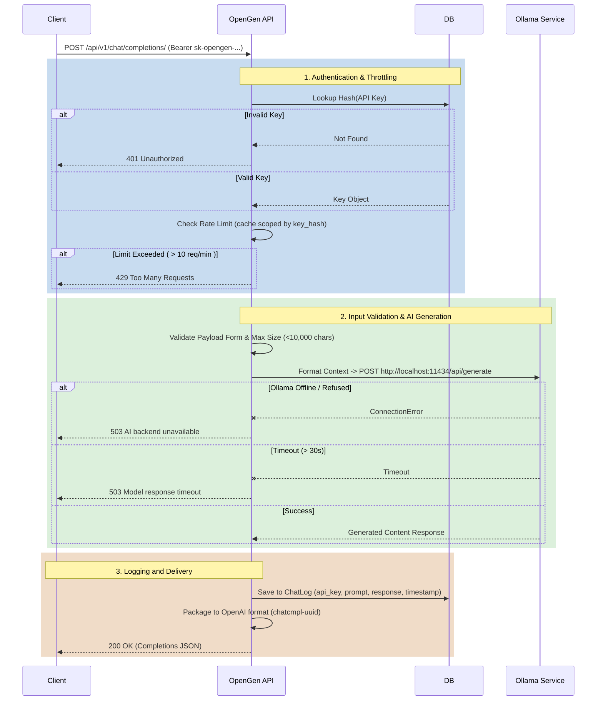

# Sequence Diagram

This document illustrates the complete request lifecycle of the OpenGen AI service.

```mermaid
sequenceDiagram
    participant Client
    participant OpenGen API
    participant DB
    participant Ollama Service

    Client->>OpenGen API: POST /api/v1/chat/completions/ (Bearer sk-opengen-...)
    
    rect rgb(200, 220, 240)
        Note over OpenGen API,DB: 1. Authentication & Throttling
        OpenGen API->>DB: Lookup Hash(API Key)
        alt Invalid Key
            DB-->>OpenGen API: Not Found
            OpenGen API-->>Client: 401 Unauthorized
        else Valid Key
            DB-->>OpenGen API: Key Object
        end
        OpenGen API->>OpenGen API: Check Rate Limit (cache scoped by key_hash)
        alt Limit Exceeded ( > 10 req/min )
            OpenGen API-->>Client: 429 Too Many Requests
        end
    end
    
    rect rgb(220, 240, 220)
        Note over OpenGen API,Ollama Service: 2. Input Validation & AI Generation
        OpenGen API->>OpenGen API: Validate Payload Form & Max Size (<10,000 chars)
        OpenGen API->>Ollama Service: Format Context -> POST http://localhost:11434/api/generate
        
        alt Ollama Offline / Refused
            Ollama Service--xOpenGen API: ConnectionError
            OpenGen API-->>Client: 503 AI backend unavailable
        else Timeout (> 30s)
            Ollama Service--xOpenGen API: Timeout
            OpenGen API-->>Client: 503 Model response timeout
        else Success
            Ollama Service-->>OpenGen API: Generated Content Response
        end
    end
    
    rect rgb(240, 220, 200)
        Note over OpenGen API,Client: 3. Logging and Delivery
        OpenGen API->>DB: Save to ChatLog (api_key, prompt, response, timestamp)
        OpenGen API->>OpenGen API: Package to OpenAI format (chatcmpl-uuid)
        OpenGen API-->>Client: 200 OK (Completions JSON)
    end
```
